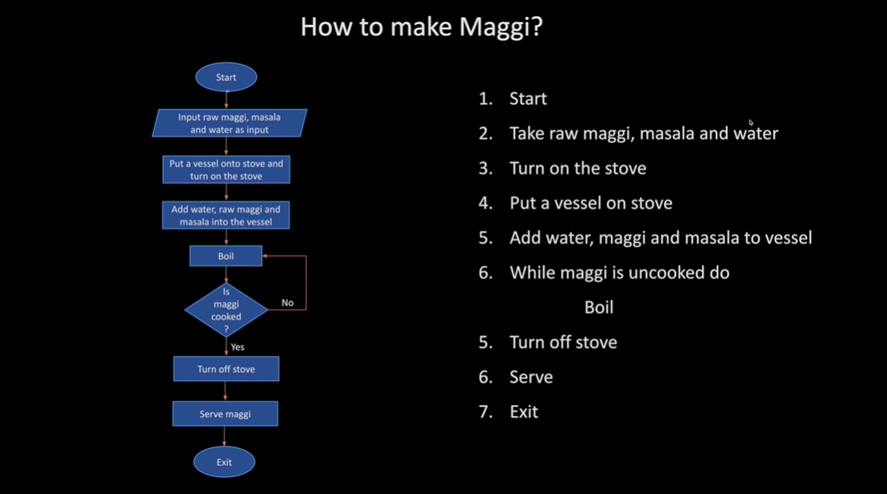
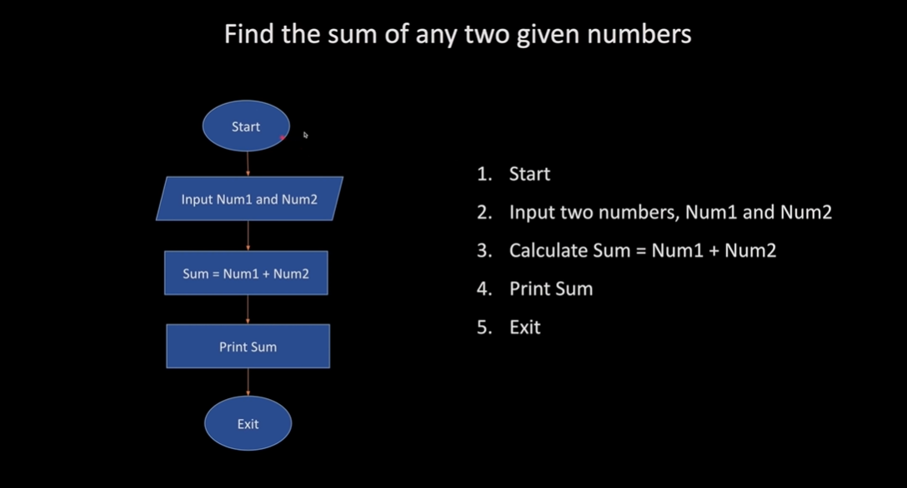
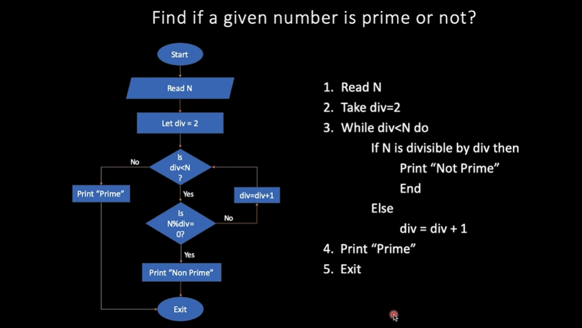
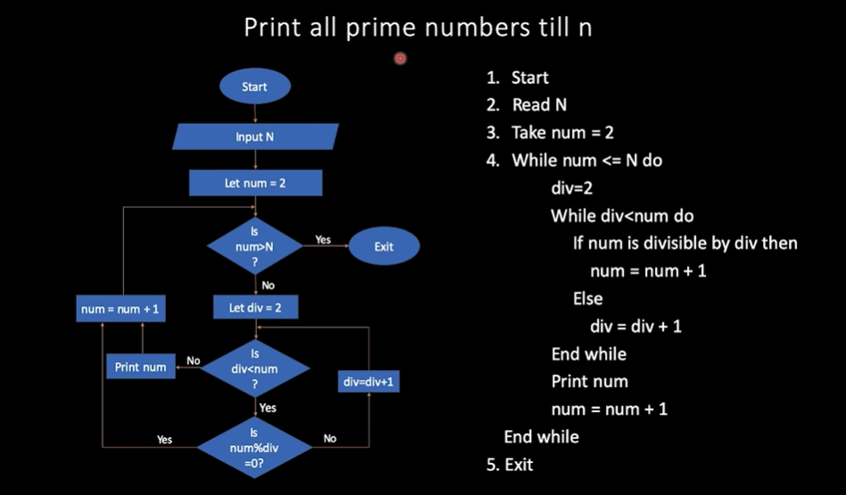

# Introduction

- To communicate with our computer we need language other than Hindi or English which computer understands.
- Computer understand only 0 and 1 (Binary Numbers) in electronics components.

  0 - High Voltage

  1 - Low Voltage

- High Level Language helps us to communicate easily with computer (C++ Language)
- We are using C++ as a language to give command or instructions to the computer to perform something.

## Flowchart :

- Real life example : How to make Maggi?
  

- Find the sum of any two given numbers -
  

- Find the maximum of three given numbers -
  

- Find if a given number is prime or not -
  

- Print all prime numbers till n -
  

### First Program :

- To print Hello World

      #include <bits/stdc++.h>
      using namespace std;

      int32_t main() {
          cout <<"Hello World!\n";
      }

- **Output :** Hello World!

### Second Program :

- To add two numbers -

      // Add Two Numbers -

      #include<iostream>
      using namespace std;

      int main() {
          #ifndef ONLINE_JUDGE
              freopen("input.txt","r",stdin);
              freopen("output.txt","w",stdout);
          #endif

          int a,b;
          cin>>a>>b;
          cout<<a+b<<"\n";
          return 0;
      }

- We need to two file to get input and output of the program -
  - input.txt
  - output.txt
